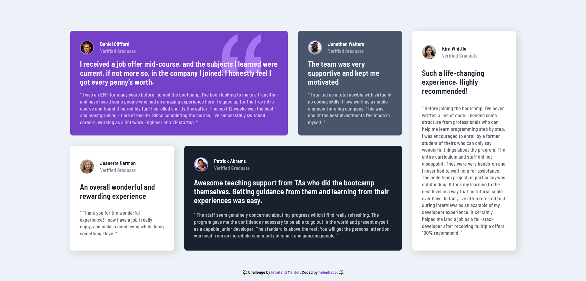

# Frontend Mentor - Testimonials grid section solution

This is a solution to the [Testimonials grid section challenge on Frontend Mentor](https://www.frontendmentor.io/challenges/testimonials-grid-section-Nnw6J7Un7). Frontend Mentor challenges help you improve your coding skills by building realistic projects.

## Table of contents

- [Overview](#overview)
  - [The challenge](#the-challenge)
  - [Screenshot](#screenshot)
  - [Links](#links)
- [My process](#my-process)
  - [Built with](#built-with)
  - [What I learned](#what-i-learned)
  - [Continued development](#continued-development)
  - [Useful resources](#useful-resources)
- # [Author](#author)

## Overview

### The challenge

Users should be able to:

- View the optimal layout for the site depending on their device's screen size

### Screenshot

- Desktop:

- Tablet:

- Mobile:

### Links

- [Solution](https://github.com/helenhapp/helenhapp.github.io/tree/main/frontend-mentor/junior/testimonials-grid-section-main)
- [Live Site](https://helenhapp.github.io/frontend-mentor/junior/testimonials-grid-section-main/index.html)

## My process

### Built with

- Semantic HTML5 markup
- CSS custom properties
- Flexbox
- CSS Grid
- Mobile-first workflow

### What I learned

I became more familiar with using CSS Grid and tried my best to make the webpage look good on different devices. I also learned how to set a background-image.

### Continued development

CSS Grid is a powerful tool and I wish to continue exploring it until I become well familiar with all its abilities and understand when to use them.

### Useful resources

- [Grid Garden](https://cssgridgarden.com/) - This is an amazing game to practice using CSS Grid.

## Author

- Frontend Mentor - [helenhapp](https://www.frontendmentor.io/profile/helenhapp)
