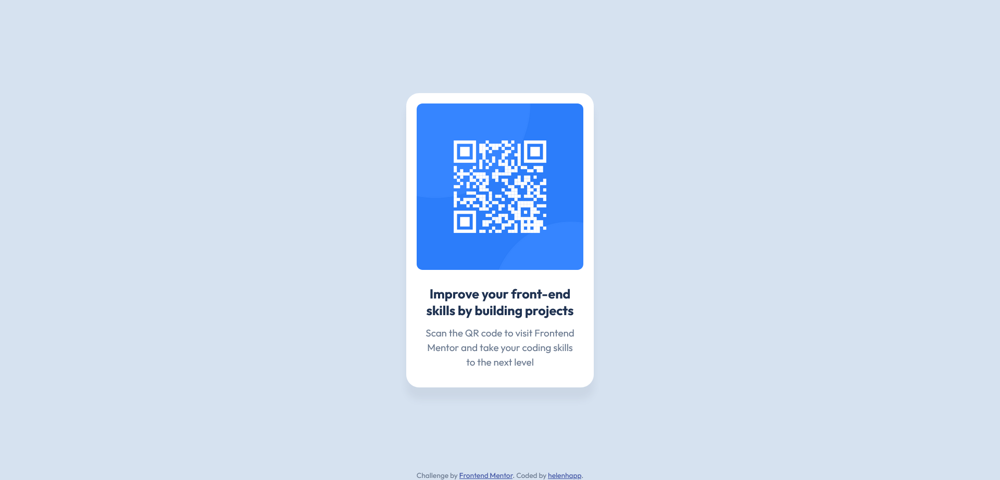

# Frontend Mentor - QR code component solution

This is a solution to the [QR code component challenge on Frontend Mentor](https://www.frontendmentor.io/challenges/qr-code-component-iux_sIO_H). Frontend Mentor challenges help you improve your coding skills by building realistic projects.

## Table of contents

- [Overview](#overview)
  - [Screenshot](#screenshot)
  - [Links](#links)
- [My process](#my-process)
  - [Built with](#built-with)
  - [What I learned](#what-i-learned)
  - [Continued development](#continued-development)
- [Author](#author)

## Overview

### Screenshot

### Links

- [Solution](https://github.com/helenhapp/helenhapp.github.io/tree/main/qr-code-component-main)
- [Live Site](https://helenhapp.github.io/qr-code-component-main/index.html)

## My process

### Built with

- Semantic HTML5 markup
- CSS custom properties
- Flexbox
- Mobile-first workflow

### What I learned

It is my second attempt to learn front-end development, and I tried this challenge before, over a year ago. But I still had to google "how to center a div" and learn about flexbox again, and what "height: 100vh;" does, and I also learned what dvh is (dynamic viewport height) to make the page look better on mobile. But overall, it this challenge was simple enough and took me under 30 minutes to complete.

### Continued development

I want to learn and become really comfortable with using flexbox. I also want to learn more about what units (px, em, rem etc) are best in different situations.

## Author

- Frontend Mentor - [helenhapp](https://www.frontendmentor.io/profile/helenhapp)
